```{r setup, include=FALSE}
knitr::opts_chunk$set(echo = FALSE)
options(scipen = 999)
```

# Introducción

+ Existe una relación entre ingreso y consumo de aire acondicionado.

+ Los países de ingreso medio son los que más van a contribuir al crecimiento en su demanda (países como EEUU ya alcanzaron el 90% de los hogares).

+ Piensen en el potencial de China e India. El problema es la demanda de energía (generación y distribución).

+ Con datos de México se modela la relación entre el consumo de AC, temperatura e ingreso.

+ Posteriormente se usaron las estimaciones para predecir el consumo de energia.

+ En un escenario muy conservador, se predice saturación de AC en zonas de alta temperatura en tan solo unas décadas.

+ En cuanto al consumo de energia, este dependerá del cambio tecnológico: mejoras en eficiencia en la generación de energia y/o en el consumo energético de los AC.

---

# Introducción

La relación AC, clima e ingreso se analiza en dos sentidos:

+ Margenes intensivos: $(C_{electricity}|AC)= f( X_{temp})$

+ Márgenes extensivos: $AC= f(X_{temp},X_{income})$

---
# Margenes intensivos

Efectos fijos:

$$ln(y_{it})=\sum_j \alpha_jTEMP_{itj}+\beta RAIN_{it}+\gamma_i+\omega_t+\epsilon_{it}$$
donde:

+ $y_{it}$: consumo de electricidad del hogar t en el ciclo de cobro i.

+ TEMP: cantidad de días en los que la temperatura promedio estuvo en cada cateogría

+ $i$: ciclo de cobro de la luz

+ RAIN: variable de control sobre los días de lluvia durante el ciclo.

+ $\gamma_i$: efectos fijos de cada hogar

+ $\omega_i$: otros efectos fijos generales


---
# Margenes intensivos

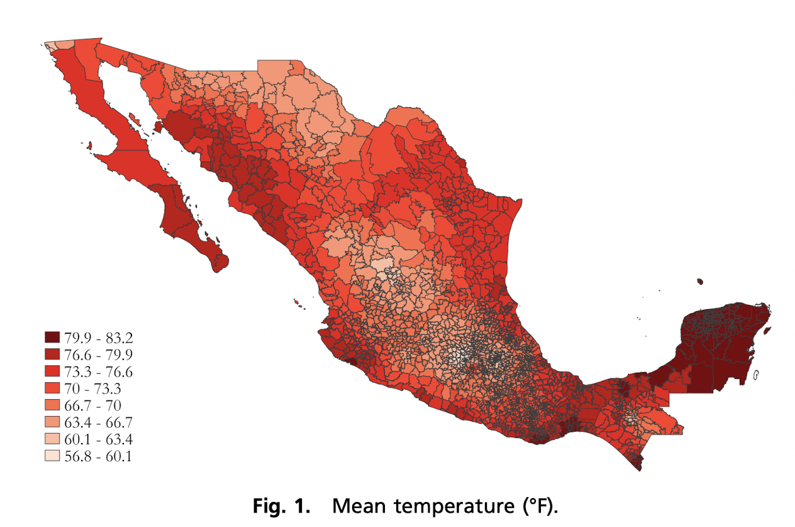


---
# Margenes intensivos

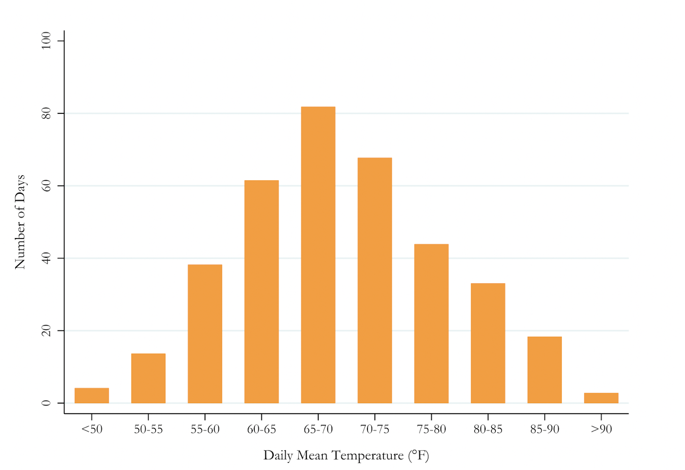

---
# Margenes intensivos

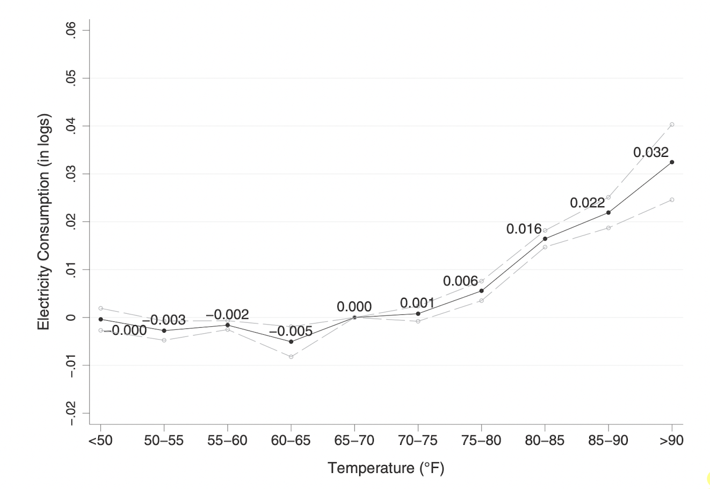
---
# Margenes intensivos

**Resultados**

+ No hay U-shape con en otros países

+ Efecto es cero como hasta los 70º 

+ A partir de ahí el efecto es positivo y creciente.

+ En particular, en el ultimo grupo (>90º) cada día adiconal aumenta el consumo de electricidad en 3.2%

---
# The Extensive Margin - Definition
<div style="text-align: justify">

El *extensive margin* mide la relación existente entre $\color{#F25E3D}{\text{el clima}}$, $\color{#7ED957}{\text{el ingreso de los hogares}}$ y $\color{#4B5C96}{\text{la adopción de aire acondicionado}}$. Por ello, los autores recurren a los datos de la *Encuesta Nacional de Ingresos y Gastos de los Hogares (ENIGH)* del INEGI para el año 2010 de donde extraen la información para 27,000 hogares y la combinan con los datos sobre clima.

--

De manera intuitiva podemos entender el porqué de la estrategia debido a que es lógico esperar que los hogares con más recursos tengan mayor facilidad de acceso a artículos como aire acondicionado. Adicionalmente, extiende el análisis "simplista" de solo considerar la temperatura en las localidades y aprovecha información detallada de los hogares disponible para México.

--

De acuerdo con la información disponible para ese año, el 99% de los hogares reportó tener acceso a electricidad. El consumo anual per cápita del país era de 2,000 kW/h similar a Tayikistán (2,000), Costa Rica (1,900), Tailandia (2,200) y Panamá (1,800) aunque menor que Brasil (2,400) y Estados Unidos (13,300).

--

Respecto a la adopción de **aire acondicionado** el 13% del hogares reportó tener al menos uno. La "saturación" por estado tiene un patrón geográfico claramente concentrado en el noroeste, noreste y algunos estados del sureste. 

---
# Geographical Pattern of Air Conditioning saturation by state in Mexico

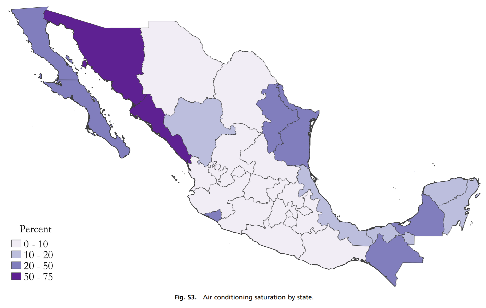

---
# Geografía, Aire y Economía
<div style="text-align: justify">
En línea con el mapa, la "saturación" del aire acondicionado varía mucho desde casi cero en la zona central del país hasta arriba de 50% en algunos estados costeros. Inclusive en un análisis geográfico de altitud, los autores apuntan a que las zonas con más aire acondicionado son aquellas que están más cerca del nivel del mar. Las cordilleras que atraviesan el país de norte a sur coinciden con zonas menos calurosas y donde no es necesario tener un aire acondicionado. 

--

Sin embargo, más allá de los patrones puramente físicos los autores también coinciden en que la adopción del aire acondicionado refleja factores económicos. El ingreso promedio de los hogares tiene a ser menor en el sur y las zonas costeras con *menor* "saturación" de aire acondicionado son precisamente los estados más pobres de México: Guerrero, Oaxaca y Chiapas. 

--

Adicionalmente, una de las razones por las cuales México es un lugar idóneo para el análisis empírico de la adopción de aire acondicionado en los hogares es por la varianza en el ingreso de los hogares. El PIB per cápita en México era de 10,300 dólares anuales (datos del texto para 2013) pero con variaciones enormes donde el 25% más bajo viven con menos de 3,300 dólares.

---

# The Extensive Margin - Hallazgos
<div style="text-align: justify">

Tanto el clima como el ingreso son importantes en la predicción de la adopción de aire acondicionado en los hogares pero **la interacción** entre ambas es considerablemente más importante que las variables por separado. La siguiente pregunta es: ¿este efecto es igual para todas las zonas independientemente de su clima?

--

Para explorar esta hipótesis los autores presentan dos figuras comparando el ingreso de los hogares con la proporción de estas unidades que tienen aire acondicionado: 

--

1. $\color{blue}{\text{Municipios fríos.}}$
2. $\color{#ED3939}{\text{Municipios calurosos.}}$

--

El punto de quiebre es la media del número de "cooling degree days" (CDDs). El ingreso está expresado en dólares y graficado con una transformación logarítimica tiene forma de una distribución normal. 

---
# The Extensive Margin - Municipios Fríos 


---
# The Extensive Margin - Municipios Calurosos

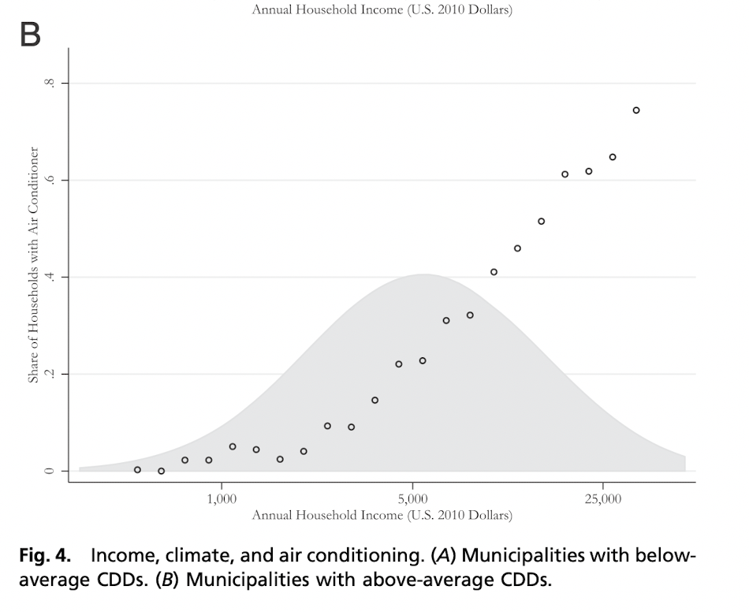

---
# The Extensive Margin - Ingreso y Aire
<div style="text-align: justify">

La relación entre el ingreso y la posesión de aire acondicionado en el hogar es distinta dependiendo de las condiciones climáticas del municipio. En los más fríos solo los hogares muy "ricos" consideran tener este aparato en el hogar pero nunca representa más del 10% de los hogares. Por el contrario, en los municipios calurosos hay una relación positiva entre el ingreso y la posesión de un aire acondicionado. Dentro de los hogares con más recursos cerca del 80% cuanta con este artefacto. 

--

El posible conflicto de estas figuras es que la división entre "frío" y "caluroso" es relativamente arbitraria y burda (en palabras de los autores: *"raw data"*) lo cual podría ser aún más problemático para los municipios con temperaturas cercanas a la media. Sin embargo, el hallazgo para las localidades calurosas es evidente y el incremento de la proporción de los hogares con aire es muy marcada. 

--

Estos hallazgos también se pueden comprobar de manera econonométrica usando como variable dependiente una dummy que indique si el hogar tiene aire acondicionado o no. Con la finalidad de probar la robustez del análisis los autores presentan estimaciones de un modelo lineal de probabilidad simple con ingreso, con gasto como proxy de ingreso, con efectos fijos por región y estado e incluso un término cuadrático para precipitación. Un par de regresiones emplean el modelo de tipo probit.  

---

# The Extensive Margin - Estimaciones

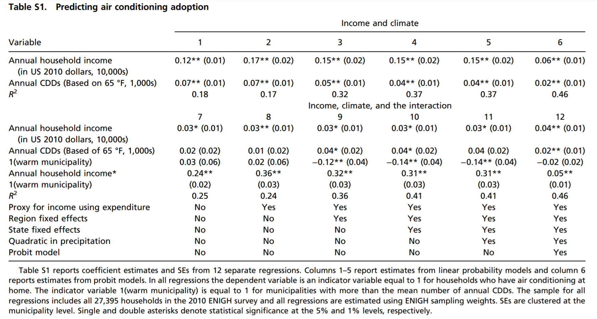
Los modelos se dividen: a) de 1-6 con ingreso y clima; b) de 7 a 12 con la interacción del ingreso con la dummy de municipio de clima caluroso. Los incrementos en la *x* son de $10,000 dllrs.

---
# The Extensive Margin - Discusión
<div style="text-align: justify">

Los resultados de las estimaciones muestran efectos considerables y robustos a la inclusión de los efectos fijos. Partiendo de los modelos en el panel superior, por utilizar como ejemplo la columna 1, un aumento de $10,000 dólares en el ingreso del hogar conlleva un incremento en la posesión de aire acondicionado de 12 puntos porcentuales. La desviación estándar del ingreso en la base de la ENIGH es de 6,500 dólares por lo que un aumento en una desviación, se traduce en un aumento en la probabilidad de tener aire de 8 puntos porcentuales. Los valores de los coeficientes son relativamente más grandes en las columnas 2 a 5 donde se usa el gasto como proxy del ingreso.

--

En el caso de los modelos de la parte inferior se observa como el término de la interacción de ingreso con la dummy de municipios calurosos es mucho más grande y significativo en todas las especificaciones. En el caso de la columna 11, el coeficiente de 0.31 indica que un aumento en 10,000 dólares del hogar en un municipio caluroso conlleva un aumento de 31 puntos porcentuales en la probabilidad de que el hogar tenga un aire acondicionado. 

 
---

# Forecasting End of Century Energy Use
En las diapositivas anteriores, mencionamos que los autores encontraron las
siguientes relaciones con respecto a la demanda de electricidad (intensivo) y
la adquisición de nuevos aparatos de enfriamiento (extensivo). Los efectos fueron:

  + Un incremento en el número de días con temperaturas altas, implica un aumento
  en la demanda de electricidad por parte de los hogares.
  
  + Un incremento en el ingreso y en el número de días calurosos incrementan
  la adopcion de tecnologías de enfriamiento por parte de los hogares. 

Utilizando los efectos estimados, los autores estiman el incremento
en la demanda por electricidad (y emisión de gases invernadero) por parte de los hogares.
---
# Forecasting End of Century Energy Use
## Predicción de Temperaturas
Los autores generaron una serie con las temperaturas para cada municipio del país al final del siglo. 
Esto se logró utilizando temperaturas actuales y sumándoles los cambios en las temperaturas de cada mes que se esperan según las predicciones encontradas en *Climate Wizard* (http://www.climatewizard.org) para dos escenarios (RCP 4.5 y 8.5). 

```{r, echo=FALSE, out.width="50%", fig.cap="Cambios en la distribución del promedio de temperaturas diarias (RCP 8.5).", fig.align="center"}
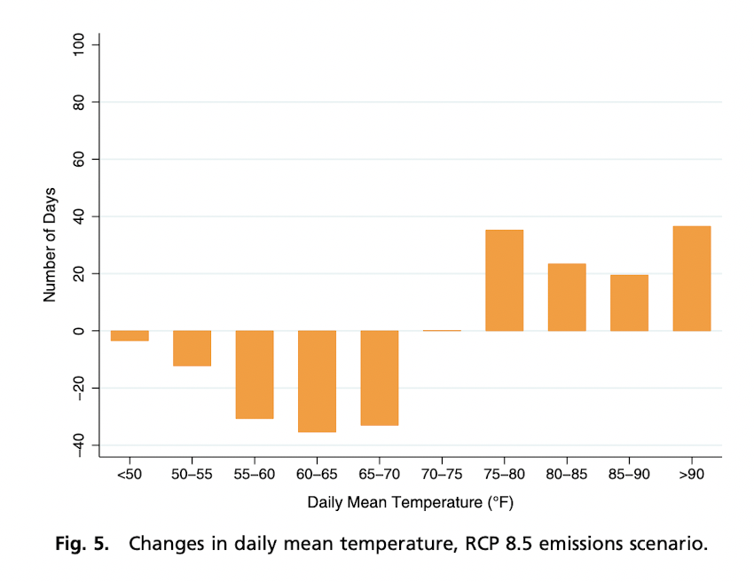
```

---

# Forecasting End of Century Energy Use
## Predicciones del margen intensivo

Utilizando la función de respuesta de los hogares con respecto al clima/temperatura y manteniendo constante el nivel de aparatos de enfriamiento (*ceteris paribus*), los autores obtuvieron las siguientes predicciones sobre qué pasará con la demanda por energía:

```{r, echo=FALSE, out.width="95%", fig.cap="", fig.align="center"}
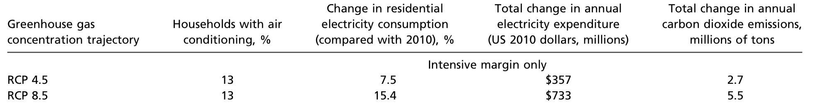
```

---
# Forecasting End of Century Energy Use
## Predicciones del margen intensivo + margen extensivo

Para incorporar al análisis el margen extensivo, los autores asumen un crecimiento de 2% en el producto interno bruto de México (PIB == Ingreso). El supuesto implica que el ingreso de las familias (o la economia mexicana) será 4 veces mayor dentro de 70 años. Los resultados obtenidos son los siguientes

```{r, echo=FALSE, out.width="95%", fig.cap="", fig.align="center"}
knitr::include_graphics("img/Forecast2.png")
```

---
# Forecasting End of Century Energy Use

Al incorporar el efecto del uso extensivo al análisis, podemos observar que los hogares empiezan a adquirir aire acondicionado. Dado que México es un país de ingreso medio, los autores esperan que este efecto no se observe solo en México, sino que también los demás **países de ingreso medio/bajo empiecen a adquirir una mayor cantidad de equipos de enfriamiento (aires acondicionados)**. Las implicaciones del incremento en la adquisición de aires acondicionado son
  1. Un incremento en la emisión de dioxido de carbono y producción de energía.
  2. Un incremento en la inversión para incrementar la capacidad y distribución de energía electrica. 
  
Otro hecho importante a destacar es que el **efecto ingreso** es mucho más grande que el de la temperatura. 

---
# Forecasting End of Century Energy Use

```{r, echo=FALSE, out.width="95%", fig.cap="", fig.align="center"}
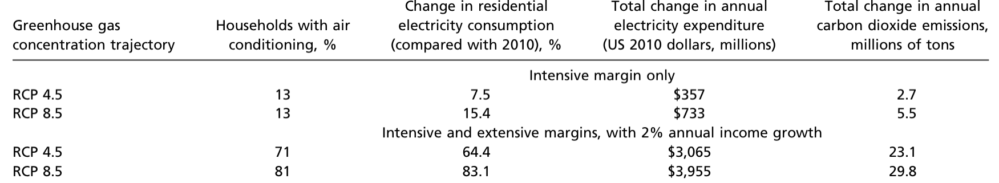
```
---
#Forecasting End of Century Energy Use

En la siguiente tabla se muestran  algunas características para países similares en ingreso que México.

```{r, echo=FALSE, out.width="95%", fig.cap="", fig.align="center"}
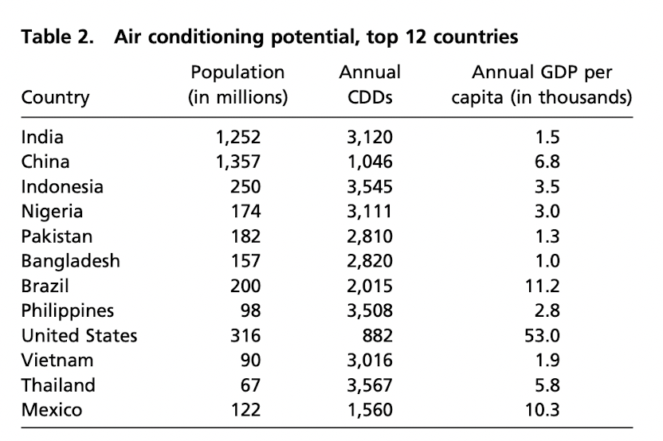
```

---
# Conclusiones
<div style="text-align: justify">

El artículo muestra los enormes impactos potenciales a nivel global de la adopción progresiva del aire acondicionado en los hogares con un enfoque particular en las economías en vías de desarrollo. En días calurosos, la evidencia muestra que existen aumentos importantes en el consumo de energía. 

--

Sin embargo, el aporte de este texto se encuentra en la inclusión del ingreso como variable relevante entre la adopción de este tipo de aparatos y el clima. Las estimaciones encuentran que con aumentos en los recursos dentro del hogar, la probabilidad de adquirir un aire acondicionado es alta. Inclusive las predicciones del artículo muestran una cobertura prácticamente universal en zonas calurosas en las décadas posteriores a la fecha de publicación.

```{r, echo=FALSE, out.width="40%", fig.align="center"}
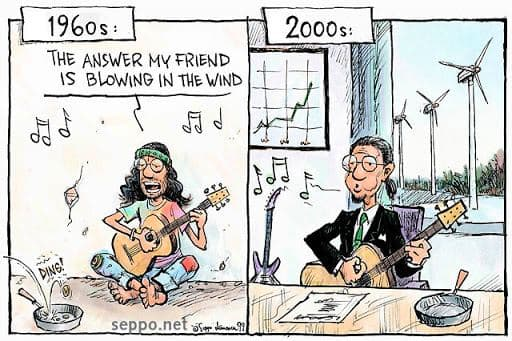
```

---
# Conclusiones
<div style="text-align: justify">

De acuerdo con los propios autores, el cumplimiento de sus predicciones dependería de la velocidad del cambio tecnológico y algunas mejoras en el mercado de los aires acondicionados como la adopción de herramientas de consumo de energía. Adicionalmente, cambios en precios podrían impactar en la relación entre ingreso, clima y la adopción del aparato. Estas diferencias podrían ser no solo en el precio del aire acondicionado como tal, si no de la electricidad. 


--

Como parte de un análisis propio sobre el artículo encontramos algunas ventajas y desventajas. En cuanto a los puntos positivos del texto se encuentra una exposición clara y articulada de un argumento bastante sencillo pero revelador sobre la relación del clima, el ingreso de los hogares y la adopción del aire acondicionado (*extensive margin*). Las estimaciones son robustas, la inclusión de las predicciones es hasta cierto punto innovadora y los datos son de buena calidad y confiabilidad. 

--

Sin embargo, encontramos en el artículo algo de sesgo y una actitud ligeramente condescendiente hacia las economías en vías de desarrollo. Esto podría malentenderse como una señalización hacia los hogares de países como México tratando de responsabilizarlos por futuras consecuencias climáticas y restando importancia a países de economías avanzadas como Estados Unidos. 
